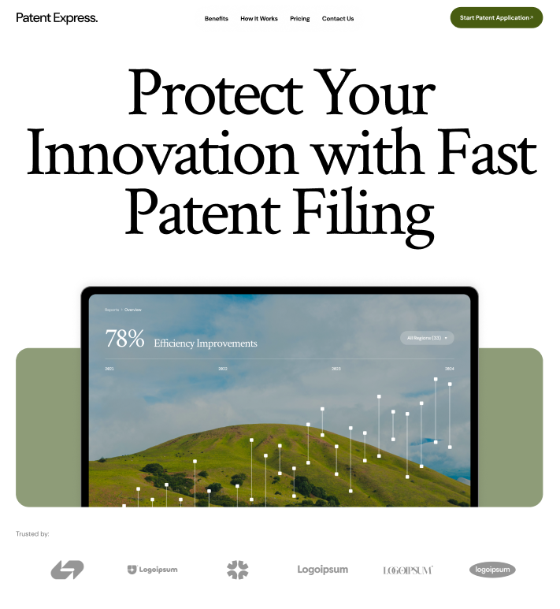
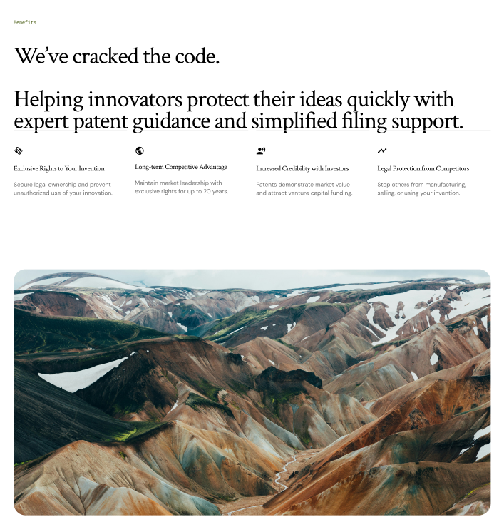
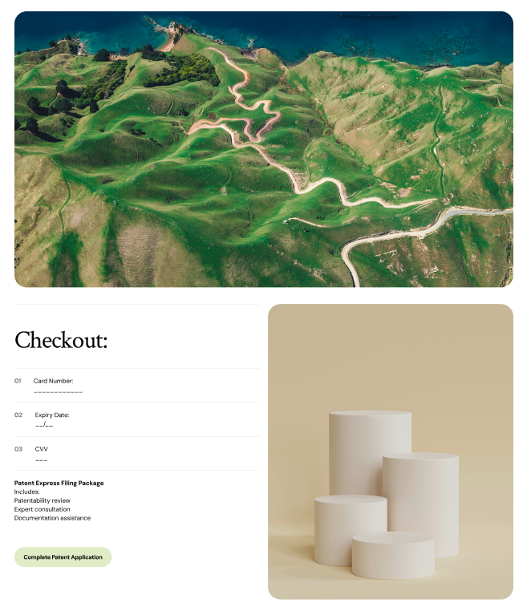

# Patent Express UX Redesign

A UX redesign of the **Patent Express** user journey aimed at improving service clarity, reducing friction in the lead generation process, and guiding users smoothly from discovery to checkout.

This project was created as part of a design assignment to evaluate UI design skills, product thinking, UX flow structuring, and the ability to communicate product value effectively.

---

## Project Overview

Patent Express is a service designed to help innovators protect their intellectual property by guiding them through the patent filing process.

The redesign focuses on improving how the service is communicated and simplifying the user journey.

Key goals of the redesign:

- Improve clarity of the Patent Express service
- Simplify lead generation
- Reduce friction in the application process
- Build trust with users
- Create a smooth path from landing page to checkout

---

## Redesigned User Flow

The redesigned journey follows a clear progression:

Landing Page → Lead Generation → Checkout

Users first understand the service and its benefits, then submit information about their invention, and finally complete the purchase through a streamlined checkout experience.

---

## Landing Page

The landing page focuses on clearly explaining the Patent Express service.

Key elements include:

- Clear value proposition
- Benefits of patent protection
- Step-by-step explanation of the process
- Strong call-to-action
- Trust signals for credibility

---

## Lead Generation Flow

Instead of presenting a long form, the lead generation process collects information in a structured way to reduce friction and encourage users to proceed.

Information captured includes:

- Patent title
- Patent category
- Short description of the invention
- User contact details

---

## Checkout Experience

The checkout page allows users to review the service details and complete payment with confidence.

Features include:

- Service summary
- Transparent pricing
- User information review
- Simple and secure payment fields

---

## Key UX Improvements

- Clear service explanation for first-time users
- Structured user journey from discovery to checkout
- Reduced form complexity
- Stronger trust signals
- Transparent pricing information

---

## Figma Prototype

View the full interactive prototype here:

[https://www.figma.com/site/wl0qxRGmiPvwkYx8cxDGap/Patent-Express?node-id=0-1&t=ujyQQJT8B7hDdCpM-1]
---
